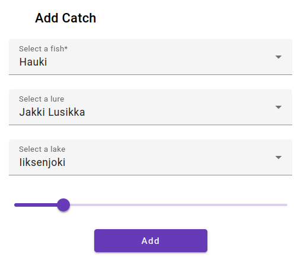

# Kalakaveri

This repository is front-end for my fishing application. I'm doing this as a hobby project to learn Angular and Spring Boot. This will also be nice project considering my fishing hobby.

## State
Connection to Spring Boot backend is working properly. Creating forms right now.

## Todo
- Lure, Fish, Lake and ~~Catch~~ forms.
- Tables for ~~Lures~~, ~~Lakes~~ and ~~Fishes~~.

## Adding new catches
- You can add new catches through catch form. 
 
    
